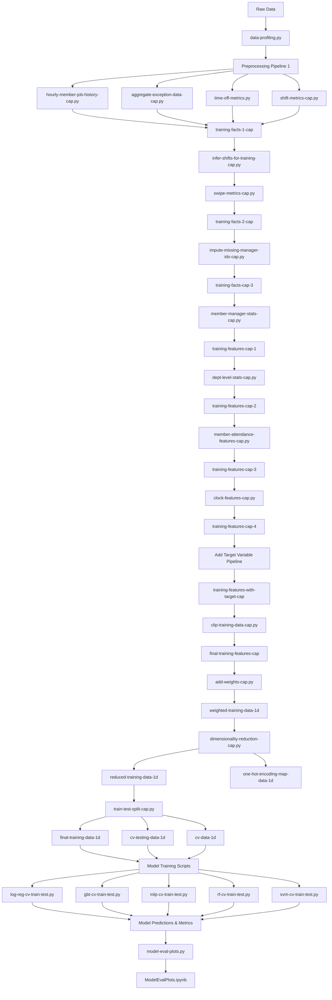

# Employee No-Show Prediction - Capstone Project

This repository contains the complete machine learning pipeline for predicting employee no-shows, built using PySpark and Palantir Foundry.

## Project Overview

This project tackles an extreme class imbalance problem (0.15% no-show rate) using temporal weighting, stratified cross-validation, and comprehensive model evaluation across multiple ML algorithms.

## Repository Structure
```
capstone-noshow-predictor/
├── data-cleaning-preprocessing/
├── eda-feature-engineering/
├── model-training-eval/
│   └── prismSparkML/
└── README.md
```

## Pipeline Execution Order

### Phase 1: Data Cleaning & Preprocessing

Initial data cleaning was performed using Palantir Foundry's pipeline builder tool (string formatting, data types, timestamps, etc.).

#### 1. Data Profiling
```
data-profiling.py
```
- Profiles all ingested datasets
- Creates data profiles used for further cleaning and preprocessing

#### 2. Preprocessing Pipeline 1
```
hourly-member-job-history-cap.py
aggregate-exception-data-cap.py
time-off-metrics.py
shift-metrics-cap.py
    ↓
training-facts-1-cap (output)
```

#### 3. Preprocessing Pipeline 2
```
training-facts-1-cap (input)
    ↓
infer-shifts-for-training-cap.py
swipe-metrics-cap.py
    ↓
training-facts-2-cap (output)
    ↓
impute-missing-manager-ids-cap.py
    ↓
training-facts-cap-3 (output)
```

### Phase 2: Feature Engineering
```
training-facts-cap-3 (input)
    ↓
member-manager-stats-cap.py
    ↓
training-features-cap-1 (output)
    ↓
dept-level-stats-cap.py
    ↓
training-features-cap-2 (output)
    ↓
member-attendance-features-cap.py
    ↓
training-features-cap-3 (output)
    ↓
clock-features-cap.py
    ↓
training-features-cap-4 (output)
    ↓
[Pipeline: Add target variable & drop noShow]
    ↓
training-features-with-target-cap
    ↓
clip-training-data-cap.py
    ↓
final-training-features-cap (output)
```

**EDA Analysis:**
- `EDA.ipynb` - Exploratory data analysis extracted from Jupyter notebook in Foundry

### Phase 3: Model Training & Evaluation

#### 3.1 Data Preparation
```
final-training-features-cap (input)
    ↓
add-weights-cap.py → weighted-training-data-1d
    ↓
dimensionality-reduction-cap.py → reduced-training-data-1d
                                 → one-hot-encoding-map-data-1d
    ↓
train-test-split-cap.py → final-training-data-1d
                        → cv-testing-data-1d
                        → cv-data-1d
```

#### 3.2 Model Training & Cross-Validation

Five algorithms were evaluated using k-fold cross-validation with temporal weighting and stratification:
```
cv-data-1d, cv-testing-data-1d, final-training-data-1d (inputs)
    ↓
┌─────────────────────────────────────────────────────────┐
│  log-reg-cv-train-test.py    (Logistic Regression)     │
│  gbt-cv-train-test.py        (Gradient Boosted Trees)  │
│  mlp-cv-train-test.py        (Multilayer Perceptron)   │
│  rf-cv-train-test.py         (Random Forest)           │
│  svm-cv-train-test.py        (Support Vector Machine)  │
└─────────────────────────────────────────────────────────┘
    ↓
Model predictions, performance metrics, confusion matrices
```

#### 3.3 Model Evaluation
```
model-eval-plots.py
    ↓
Creates datasets for evaluation visualizations:
- Precision-Recall curves
- ROC curves
- Lift charts
- Confusion matrices
    ↓
ModelEvalPlots.ipynb (visualization notebook)
```

## Complete Pipeline Flow Diagram


## Key Libraries & Dependencies

### Custom ML Library: `prismSparkML`
Located in `model-training-eval/prismSparkML/`, this library contains:

- **LogisticRegression.py** - Logistic regression implementation and utilities
- **GradientBoostedTree.py** - GBT classifier implementation
- **MultilayerPerceptron.py** - Neural network implementation
- **RandomForest.py** - Random forest classifier
- **SupportVectorMachine.py** - SVM classifier
- **dimensionalityReduction.py** - Feature selection and reduction utilities
- **modelEvaluation.py** - Model evaluation metrics and functions
- **modelingSupport.py** - Helper functions including:
  - `add_class_weights()` - Handles class imbalance
  - `encode_categorical_features()` - One-hot encoding
  - `create_feature_pipeline()` - Feature preprocessing
  - `find_optimal_hyperparameters()` - Hyperparameter optimization

### Technologies Used
- **PySpark** - Distributed data processing and ML
- **Palantir Foundry** - Data platform and pipeline builder
- **PySpark MLlib** - Machine learning algorithms
- **Python** - Primary programming language

## Model Evaluation Approach

All models are evaluated using:
- **Primary Metric**: AUPR (Area Under Precision-Recall curve) - chosen due to extreme class imbalance
- **Secondary Metrics**: AUROC, precision, recall, F1-score
- **Cross-Validation**: 3-fold temporal CV with stratification
- **Temporal Weighting**: Recent observations weighted more heavily (7-day: 4x, 8-30 day: 2x, 31-90 day: 1x)
- **Holdout Test Set**: Most recent 30 days of data

## File Descriptions

### Data Cleaning & Preprocessing
- `data-profiling.py` - Generates comprehensive data profiles
- `hourly-member-job-history-cap.py` - Processes employee job history
- `aggregate-exception-data-cap.py` - Aggregates exception/absence data
- `time-off-metrics.py` - Calculates time-off statistics
- `shift-metrics-cap.py` - Computes shift-level metrics
- `infer-shifts-for-training-cap.py` - Infers missing shift information
- `swipe-metrics-cap.py` - Processes time clock swipe data
- `impute-missing-manager-ids-cap.py` - Handles missing manager assignments

### Feature Engineering
- `member-manager-stats-cap.py` - Employee-manager relationship features
- `dept-level-stats-cap.py` - Department-level aggregate features
- `member-attendance-features-cap.py` - Historical attendance patterns
- `clock-features-cap.py` - Time clock behavior features
- `clip-training-data-cap.py` - Finalizes training dataset
- `EDA.ipynb` - Exploratory data analysis and visualization

### Model Training & Evaluation
- `add-weights-cap.py` - Adds sample weights for class imbalance
- `dimensionality-reduction-cap.py` - Feature selection (top 135 features)
- `train-test-split-cap.py` - Temporal train/validation/test splitting
- `log-reg-cv-train-test.py` - Logistic regression with hyperparameter tuning
- `gbt-cv-train-test.py` - Gradient boosted trees with tuning
- `mlp-cv-train-test.py` - Neural network with tuning
- `rf-cv-train-test.py` - Random forest with tuning
- `svm-cv-train-test.py` - Support vector machine with tuning
- `model-eval-plots.py` - Generates evaluation datasets for plotting
- `ModelEvalPlots.ipynb` - Creates evaluation visualizations

## Running the Pipeline

To execute the complete pipeline:

1. **Data Cleaning**: Run preprocessing scripts in order (1-8 as listed above)
2. **Feature Engineering**: Run feature engineering scripts sequentially (1→2→3→4→5)
3. **Model Training**: Run model training scripts (1-3 for data prep, then 4-8 for models)
4. **Evaluation**: Run `model-eval-plots.py` and open `ModelEvalPlots.ipynb`

## Results

The pipeline evaluates five different ML algorithms to identify the best approach for predicting employee no-shows, with comprehensive metrics and visualizations for model comparison.
